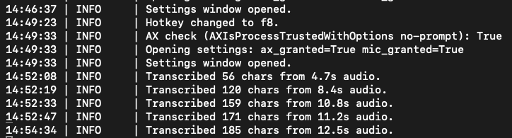
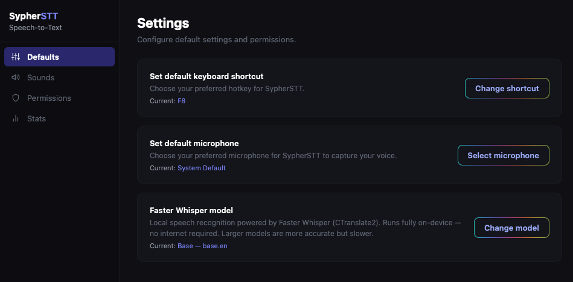
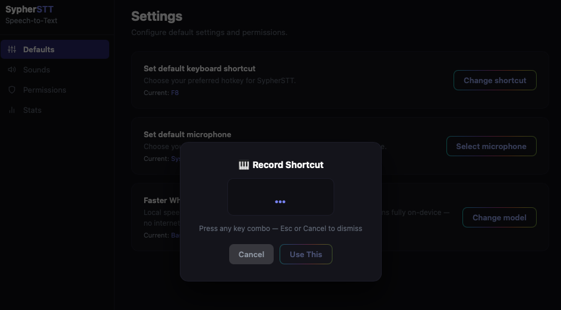
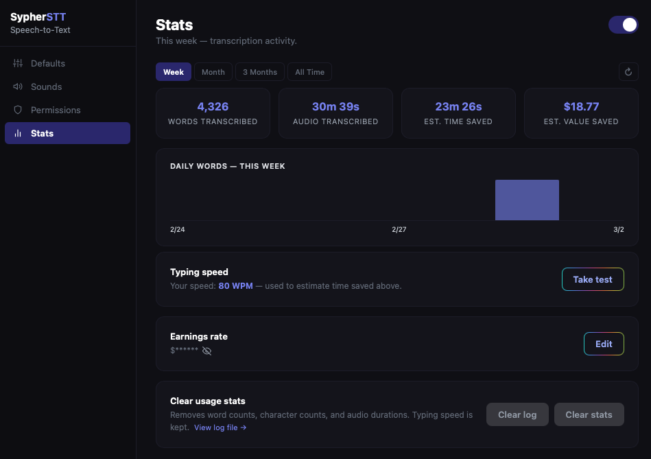

# Sypher STT — macOS

> Privacy-first, push-to-talk voice dictation for macOS. Hold a key, speak, release — transcribed text is pasted instantly. Fully offline: transcription runs locally via Faster Whisper with no API calls, no cloud services, and no audio ever leaving your machine. Free and open source — no licensing, no registration, no account required.

---

## Features

- **Menu bar app** — no Dock icon, lives quietly in the status bar
- **Push-to-talk** — hold a configurable hotkey (default: F8) to record
- **100% private & local** — Whisper runs on your Mac; no audio, text, or data ever leaves your machine
- **Apple Silicon optimized** — CTranslate2 uses NEON SIMD for fast CPU inference
- **Auto-paste** — transcribed text is pasted into whatever window is focused
- **Sound feedback** — configurable macOS system sounds for start / stop / error events
- **Live icon** — menu bar icon changes with state: 🎙 → 🔴 → ⏳
- **Setup wizard** — first-run wizard walks you through permissions, model download, and hotkey setup
- **Settings UI** — four-tab panel for hotkey, model, mic, sounds, permissions, and stats
- **Stats** — local-only usage tracking with words transcribed, audio duration, and estimated time saved
- **Typing speed test** — built-in WPM test to calibrate time-saved estimates
- **Auto-update** — checks GitHub releases in the background and prompts when a new version is available

---

## Privacy & Security

Sypher STT is designed from the ground up with privacy as a non-negotiable constraint:

- **No network access during transcription.** Whisper runs entirely on your CPU via [faster-whisper](https://github.com/SYSTRAN/faster-whisper). No API calls, no servers, no audio or transcriptions transmitted anywhere.
- **Your audio never leaves your machine.** Audio is captured and processed in local memory, then immediately discarded — never written to disk, never sent over a network.
- **No telemetry, no analytics, no accounts.** No tracking code, no remote usage reporting, no login required. The only outbound network call the app ever makes is a version check: when the Settings window opens, it queries the GitHub Releases API (`api.github.com`) to see if a newer release exists. No audio, transcriptions, stats, or personal data are included — the request carries only the app version in the User-Agent header. Transcription itself is fully air-gapped and makes no network calls at any point.
- **Usage stats are local-only and opt-out.** The Stats tab records only aggregate counts — words, characters, and audio duration per day. No transcribed text, no keystrokes, no conversation history are ever logged, stored, or transmitted. Toggle collection off from **Settings → Stats** and nothing is written anywhere.
- **Everything stays on your machine.** Config, stats, and logs live under `~/Library/Application Support/SypherSTT/` and `~/Library/Logs/SypherSTT/` with user-only (`600`) file permissions and symlink-safe writes (`O_NOFOLLOW`).

<div align="center">



*Logs are privacy minded and only show # of characters transcribed + duration of the input audio*

</div>

---

## Quick Start

```bash
# 1. Clone
git clone https://github.com/latenighthackathon/sypher-stt-macos
cd sypher-stt-macos-main

# 2. Run (creates venv + launches setup wizard automatically)
chmod +x run.sh
./run.sh
```

`run.sh` creates a `.venv`, installs dependencies, and launches the setup wizard to walk you through permissions and model selection.

---

## Manual Setup

```bash
python3 -m venv .venv
source .venv/bin/activate
pip install -e .

# Download a model (required before first run)
python scripts/download_model.py base.en

# Start
python -m sypher_stt.app
```

---

## Requirements

- **macOS 15 Sequoia or macOS 26 Tahoe** (Apple Silicon or Intel)
- **Python 3.9+**
- **Microphone access**
- **Accessibility permission** — required for global hotkey capture (see [below](#accessibility-permission-required-for-hotkey))

**Python dependencies** (installed automatically by `run.sh` or `pip install -e .`):

| Package | Purpose |
|---------|---------|
| `faster-whisper` | Local Whisper speech recognition engine |
| `sounddevice` | Microphone audio capture |
| `numpy` | Audio buffer processing |
| `pynput` | Global hotkey listener |
| `pyperclip` | Clipboard integration |
| `rumps` | macOS menu bar app framework |
| `pyobjc-framework-WebKit` | Native macOS settings UI (WKWebView) |
| `huggingface-hub` *(optional)* | First-run model download |

---

## Models

All models use [Faster Whisper](https://github.com/SYSTRAN/faster-whisper) (CTranslate2) and run fully offline.

| Model | Size | Description |
|-------|------|-------------|
| `tiny.en` | ~75 MB | Fastest · Best for quick notes |
| `base.en` | ~142 MB | Fast · Good accuracy for everyday dictation ✓ **recommended** |
| `small.en` | ~466 MB | Balanced speed and accuracy |
| `medium.en` | ~1.5 GB | High accuracy · Best for complex or accented speech |
| `large-v3` | ~3.1 GB | 1,550M params · Highest accuracy available · Slowest |
| `large-v2` | ~3.1 GB | 1,550M params · Near Large v3 accuracy · Predecessor to v3 |

```bash
# List all models and their local status
python scripts/download_model.py --list

# Download a specific model
python scripts/download_model.py small.en
```

Models are downloaded from [Hugging Face](https://huggingface.co/Systran) and stored in `models/` at the project root by default. Set `SYPHER_MODELS_DIR` to override — the path must be an absolute path inside `~/Library/Application Support/SypherSTT/` (paths outside that directory are ignored for security).

---

## Accessibility Permission (required for hotkey)

Sypher STT uses `pynput` to listen for a global hotkey. macOS requires **Accessibility permission** for any app that monitors keyboard events system-wide.

1. Open **System Settings → Privacy & Security → Accessibility**
2. Add your **Terminal** (or whichever app you launch Sypher STT from) and toggle it **on**
3. Restart Sypher STT

If you skip this step, the hotkey won't fire (but the menu bar icon will still appear). The setup wizard will guide you through this on first run.

---

## Configuration

Settings are stored in:
```
~/Library/Application Support/SypherSTT/config.json
```

| Key | Default | Description |
|-----|---------|-------------|
| `hotkey` | `"f8"` | Push-to-talk key. Supports F1–F12, Caps Lock, and modifier combos (e.g. `"option+space"`, `"ctrl+shift+f1"`). |
| `model` | `"base.en"` | Whisper model to use. Must be one of the supported model IDs. |
| `audio_device` | `null` | Input device index (`null` = system default). |
| `sound_feedback` | `true` | Play system sounds on record start / stop / error. |
| `sound_start` | `"Ping"` | macOS system sound played when recording starts. |
| `sound_stop` | `"Blow"` | macOS system sound played when recording stops. |
| `sound_error` | `"Basso"` | macOS system sound played on transcription error. |
| `record_stats` | `true` | Record per-session word count, character count, and audio duration. When `false`, nothing is written to `stats.json` or the log. |

Changes are picked up within 3 seconds without restarting. You can also edit settings via the **Settings** menu item in the menu bar.

---

## How It Works

### Transcription pipeline

```
Hold hotkey → AudioRecorder (sounddevice, 16kHz) → Whisper (faster-whisper, CPU)
           → pyperclip + Cmd+V → text appears in focused window
```

1. **Hold your hotkey** — audio capture starts immediately (sounddevice, 16 kHz mono).
2. **Release** — recording stops, the audio buffer is passed to Faster Whisper running on-device.
3. **Transcription** — Whisper returns the text in milliseconds to a few seconds depending on your chosen model.
4. **Auto-paste** — the text is written to the clipboard and `Cmd+V` is simulated so it appears wherever your cursor is.

Everything runs in-process on your Mac. No network requests are made at any point during recording or transcription.

---

### Menu bar

The menu bar icon changes state as you use the app:

| Icon | State |
|------|-------|
| 🎙 | Ready — waiting for hotkey |
| 🔴 | Recording |
| ⏳ | Transcribing |

**Menu items:**

| Item | Description |
|------|-------------|
| Status line | Shows current state and active hotkey |
| Version | `Sypher STT v<version>` |
| **Settings** | Opens the 4-tab settings panel |
| **Setup Wizard** | Re-runs the first-run wizard |
| **Uninstall** | Removes all app data and config |
| **Quit** | Exits the app |

---

### Settings

The Settings panel has four tabs:

| Tab | Contents |
|-----|----------|
| **Defaults** | Hotkey picker, microphone device, Whisper model selection (download or switch) |
| **Sounds** | Toggle sound feedback; pick start / stop / error sounds from macOS system sounds |
| **Permissions** | Live status of Accessibility and Microphone grants; links to open System Settings |
| **Stats** | Toggle stats collection; word/character/audio/time-saved cards; filter by week / month / 3 months / all time; bar chart; typing speed test; clear stats; view or clear log |

<div align="center">





</div>

---

### Stats

The Stats tab tracks usage over time. All data is stored exclusively in:

```
~/Library/Application Support/SypherSTT/stats.json
```

**Recorded per calendar day:** word count, character count, audio duration. No transcribed text, keystrokes, or conversation history is ever written.

**Optional calibration:**
- **Typing speed** — run the built-in WPM test; your score is used to compute the *Est. time saved* card.
- **Earnings rate** — enter an hourly rate or annual salary (÷ 2,080 hrs/year) to power the *Est. value saved* card. Stored locally only, never transmitted.

**From Settings → Stats you can:**
- **Clear stats** — wipes all daily counts (typing speed and earnings rate are preserved)
- **Clear log** — empties `~/Library/Logs/SypherSTT/sypher_stt.log`
- **View log file** — opens the log in your default text editor

The log rotates automatically (5 MB × 3 backups) and records only app lifecycle events and per-transcription summaries (character count, audio duration).

<div align="center">



</div>


---

## License

MIT © 2026 [LateNightHackathon](https://github.com/latenighthackathon)

Free to use, modify, distribute, and sublicense — see [LICENSE](LICENSE) for the full text.
